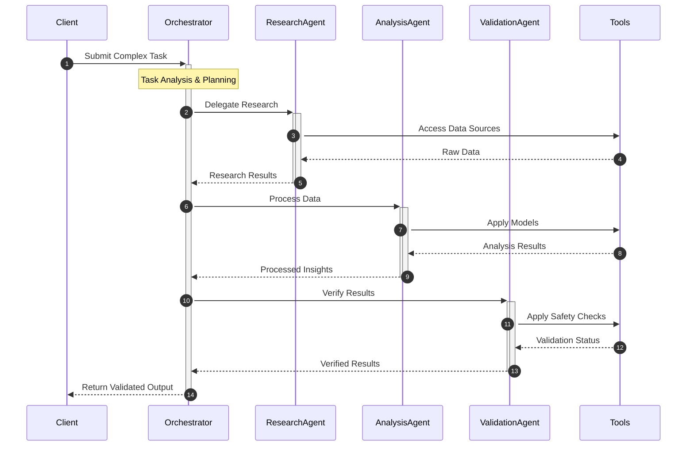

[Documentation](https://lion-agi.github.io/lionagi/) | [Discord](https://discord.gg/aqSJ2v46vu) | [PyPI](https://pypi.org/project/lionagi/) | [Roadmap](https://trello.com/b/3seomsrI/lionagi)

# LION Framework
### Language InterOperable Network - The Future of Controlled AI Operations

> Harness the power of next-generation AI while maintaining complete control and reliability.

## Why LION?

The AI revolution is transforming how we work - but with great power comes great responsibility. LION provides the control mechanisms and reliability features needed to safely integrate advanced AI capabilities into enterprise workflows.

LION is designed to be:
- 🔒 **Controlled**: Built-in safety mechanisms and verification
- 🎯 **Precise**: Exact control over AI behaviors
- 🔧 **Flexible**: Build any workflow you need
- 🚀 **Efficient**: Minimal dependencies, maximum performance


## Installation

LION maintains minimal dependencies for maximum reliability:

```bash
uv pip install lionagi
```

Dependencies:
- litellm
- jinja2
- pandas
- pillow
- python-dotenv


## Quick Start

```python
from lionagi import iModel, Branch

# Initialize model
gpt4o = iModel(provider="openai", task="chat", model="gpt-4o")

hunter = Branch(
  system="you are a hilarious dragon hunter who responds in 10 words rhymes",
  imodel=gpt4o,
)

# Chat asynchronously
print(await hunter.communicate("I am a dragon"))
```

```
You claim to be a dragon, oh what a braggin'!
```

## 📦 Features

### 1. Model Agnostic Structured Output

LION provides a unified interface for interacting with any AI model, regardless of the underlying architecture. This allows you to easily switch between models without changing your code.

```python
from pydantic import BaseModel

class Joke(BaseModel):
  joke: str

sonnet = iModel(
  provider="anthropic",
  model="claude-3-5-sonnet-20241022",
  max_tokens=100,                    # max_tokens is required for anthropic models
)

response = await hunter.communicate(
  instruction="I am a dragon",
  response_format=Joke,           # structured output in given pydantic model
  clear_messages=True,            # refresh the conversation
  imodel=sonnet,                  # use sonnet model, which doesn't support structured output
)

print(type(response))
print(response.joke)
```

```
<class '__main__.Joke'>
Joke(joke='With fiery claws, dragons hide their laughter flaws!')
```


### 2. Complete Observability

```python
# using perplexity model
pplx_small = iModel(
    provider="perplexity",
    task="chat/completions",
    model="llama-3.1-sonar-small-128k-online",
    max_tokens=1000,
)

b = await hunter.communicate(
    instruction="What makes a well-behaved dragon?",
    clear_messages=True,            # refresh the conversation
    imodel=pplx_small,              # use perplexity model
)

print(b)
```

```
A well-behaved dragon is one that's calm and bright,
No stress or fear, just a peaceful night.
It's active, not lethargic, with a happy face,
And behaviors like digging, not a frantic pace.
It's social, friendly, and never a fright,
Just a gentle soul, shining with delight
```

```python
hunter.msgs.last_response.model_response
```

```
{'id': '1be10f4c-0936-4050-ab48-91bd86ab11a5',
 'model': 'llama-3.1-sonar-small-128k-online',
 'object': 'chat.completion',
 'created': 1734369700,
 'choices': [{'index': 0,
   'message': {'role': 'assistant',
    'content': "A well-behaved dragon is one that's calm and bright,\nNo stress or fear, just a peaceful night.\nIt's active, not lethargic, with a happy face,\nAnd behaviors like digging, not a frantic pace.\nIt's social, friendly, and never a fright,\nJust a gentle soul, shining with delight"},
   'finish_reason': 'stop',
   'delta': {'role': 'assistant', 'content': ''}}],
 'usage': {'prompt_tokens': 40, 'completion_tokens': 69, 'total_tokens': 109},
 'citations': [{'url': 'https://dragonsdiet.com/blogs/dragon-care/15-bearded-dragon-behaviors-and-what-they-could-mean'},
  {'url': 'https://masterbraeokk.tripod.com/dragons/behavior.html'},
  {'url': 'https://files.eric.ed.gov/fulltext/ED247607.pdf'},
  {'url': 'https://www.travelchinaguide.com/intro/social_customs/zodiac/dragon/five-elements.htm'},
  {'url': 'https://www.travelchinaguide.com/intro/social_customs/zodiac/dragon/'}]}
```


### 3. Easy composition of complex workflows

```python
# chain of thoughts
from pydantic import Field

class Reason(BaseModel):
  reason: str
  confidence_score: float

class Thought(BaseModel):
  thought: str

class Analysis(BaseModel):
  thought: list[Thought] = Field(
    default_factory=list, 
    description="concise Chain of thoughts from you, 3 step, each in 8 words"
  )
  analysis: str = Field(
    ...,
    description="Final analysis of the dragon's psyche in 20 words",
  )
  reason: list[Reason] = Field(
    default_factory=list,
    description="Concise Reasoning behind the analysis, 3 support, each in 8 words"
  )

context1 = "I am a dragon, I think therefore I am, I suffer from shiny objects syndrome"
context2 = "I like food and poetry, I use uv sometimes, it's cool but I am not familiar with pip"

async def analyze(context) -> Analysis:
  psychologist = Branch(
    system="you are a renowned dragon psychologist",
    imodel=gpt4o,
  )
  return await psychologist.communicate(
    instruction="analyze the dragon's psyche using chain of thoughts",
    guidance="think step by step, reason with logic",
    context=context,
    response_format=Analysis,
  )

```

```python
result1 = await analyze(context1)

print("\nThoughts:")
for i in result1.thought:
    print(i.thought)

print("\nAnalysis:")    
print(result1.analysis)

print("\nReasoning:")
for i in result1.reason:
    print(i.reason)
```

```

Thoughts:
Dragons are attracted to shiny objects naturally.
This suggests a strong affinity for hoarding.
Reflects the dragon's inherent desire for possession.

Analysis:
The dragon demonstrates a compulsive hoarding behavior linked to attraction for shiny objects.

Reasoning:
Shiny objects trigger instinctual hoarding behavior.
Possession indicates a symbol of power and security.
Hoarding is reinforced by evolutionary survival mechanisms.
```

```python
result2 = await analyze(context2)

print("\nThoughts:")
for i in result2.thought:
    print(i.thought)

print("\nAnalysis:")    
print(result2.analysis)

print("\nReasoning:")
for i in result2.reason:
    print(i.reason)
```

```
Thoughts:
Dragon enjoys both food and poetry regularly.
Dragon uses uv light with frequent interest.
Dragon is unfamiliar and not comfortable with pip.

Analysis:
The dragon is curious and exploratory, yet selectively cautious about unfamiliar methodologies.

Reasoning:
Preference for food and poetry suggests curiosity.
Frequent uv light use indicates exploratory nature.
Discomfort with pip usage shows selective caution.
```


## 🌟 Example Workflow

Below is an example of what you can build with LION. Note that these are sample implementations - LION provides the building blocks, you create the workflows that fit your needs.




## 🤝 Contributing

Join our [Discord community](https://discord.gg/aqSJ2v46vu) to:
- Share ideas
- Report issues
- Contribute code
- Learn from others

## 📚 Citation

```bibtex
@software{Li_LionAGI_2023,
  author = {Haiyang Li},
  month = {12},
  year = {2023},
  title = {LionAGI: Towards Automated General Intelligence},
  url = {https://github.com/lion-agi/lionagi},
}
```
