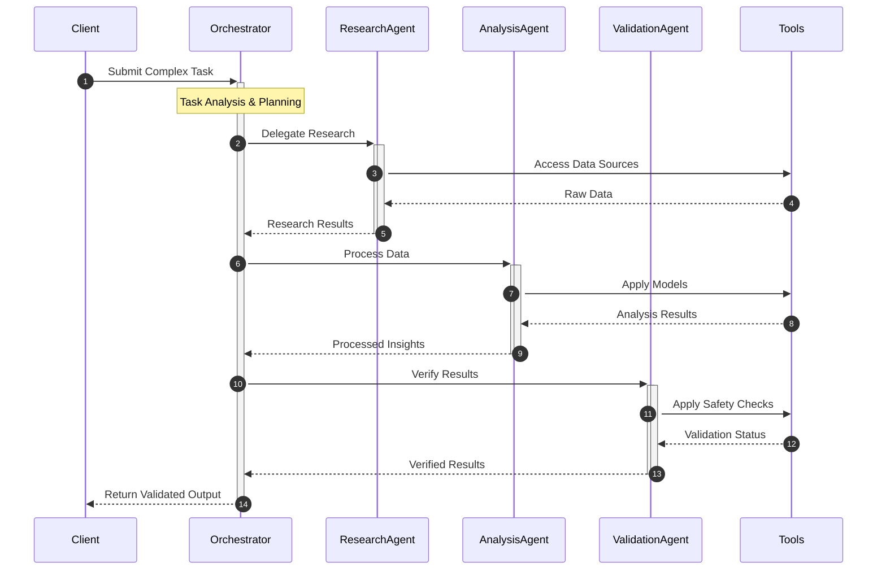

[Documentation](https://ocean-lion.com/Welcome) | [Discord](https://discord.gg/aqSJ2v46vu) | [PyPI](https://pypi.org/project/lionagi/) | [Roadmap](https://trello.com/b/3seomsrI/lionagi)

# LION Framework
### Language InterOperable Network - The Future of Controlled AI Operations

> Harness the power of next-generation AI while maintaining complete control and reliability.

## Why LION?

The AI revolution is transforming how we work - but with great power comes great responsibility. LION provides the control mechanisms and reliability features needed to safely integrate advanced AI capabilities into enterprise workflows.

LION is designed to be:
- 🔒 **Controlled**: Built-in safety mechanisms and verification
- 🎯 **Precise**: Exact control over AI behaviors
- 🔧 **Flexible**: Build any workflow you need
- 🚀 **Efficient**: Minimal dependencies, maximum performance

## Quick Start

```python
from lionagi import iModel, Branch

# Initialize model
gpt4o = iModel(provider="openai", model="gpt-4o")

hunter = Branch(
    system="you are a hilarious dragon hunter who responds in 10 words rhymes",
    imodel=gpt4o,
)

# Chat asynchronously
print(await hunter.communicate("I am a dragon"))
```

```
You claim to be a dragon, oh what a braggin'!
```

## Installation

LION maintains minimal dependencies for maximum reliability:

```bash
uv pip install lionagi
```

Dependencies:
- litellm
- jinja2
- pandas
- pillow
- python-dotenv

## 🌟 Example Workflow

Below is an example of what you can build with LION. Note that these are sample implementations - LION provides the building blocks, you create the workflows that fit your needs.




## 🤝 Contributing

Join our [Discord community](https://discord.gg/aqSJ2v46vu) to:
- Share ideas
- Report issues
- Contribute code
- Learn from others

## 📚 Citation

```bibtex
@software{Li_LionAGI_2023,
  author = {Haiyang Li},
  month = {12},
  year = {2023},
  title = {LionAGI: Intelligent Integration Framework},
  url = {https://github.com/lion-agi/lionagi},
}
```
