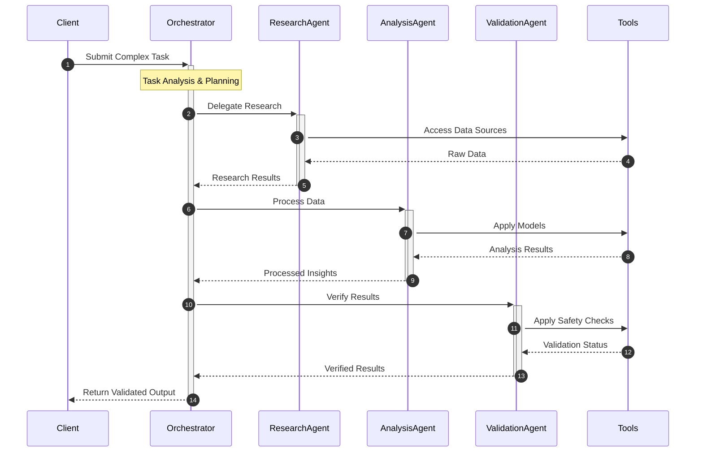
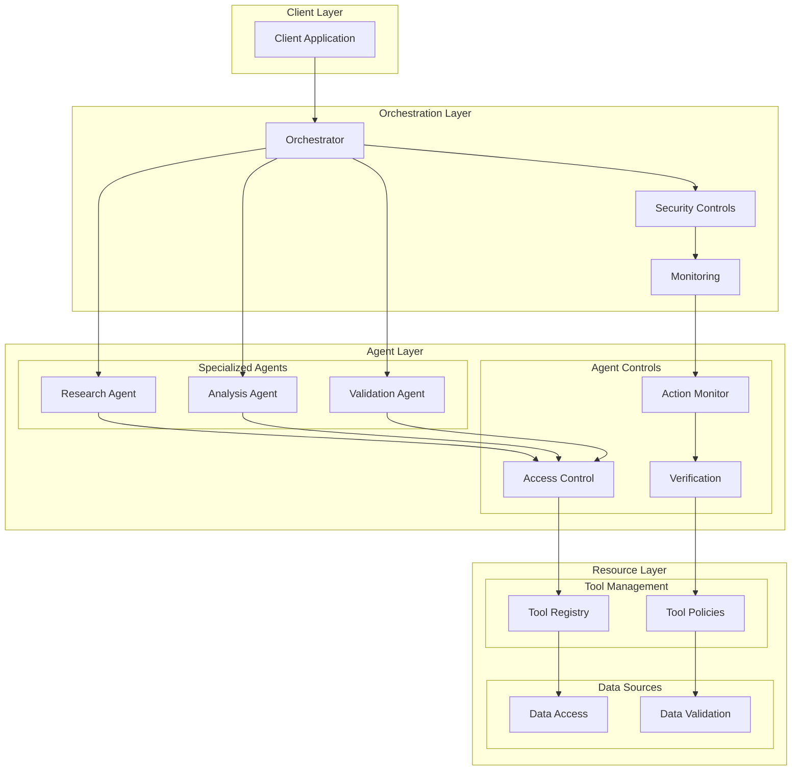

[Documentation](https://ocean-lion.com/Welcome) | [Discord](https://discord.gg/aqSJ2v46vu) | [PyPI](https://pypi.org/project/lionagi/) | [Roadmap](https://trello.com/b/3seomsrI/lionagi)

# LION Framework
### Language InterOperable Network - The Future of Controlled AI Operations

> Harness the power of next-generation AI while maintaining complete control and reliability.

## Why LION?

The AI revolution is transforming how we work - but with great power comes great responsibility. LION provides the control mechanisms and reliability features needed to safely integrate advanced AI capabilities into enterprise workflows.

LION is designed to be:
- 🔒 **Controlled**: Built-in safety mechanisms and verification
- 🎯 **Precise**: Exact control over AI behaviors
- 🔧 **Flexible**: Build any workflow you need
- 🚀 **Efficient**: Minimal dependencies, maximum performance

## Quick Start

```python
from lionagi import Branch, iModel

# Initialize model
gpt4o = iModel(provider="openai", model="gpt-4o")

# Create a branch with personality
comedian = Branch(
    system="you are a sarcastic dragon hunter",
    imodel=gpt4o
)

# Chat asynchronously
response = await branch.chat(
    "tell me a joke on knight vs dragon"
)
```

## Installation

LION maintains minimal dependencies for maximum reliability:

```bash
pip install lionagi
```

Dependencies:
- aiocache
- lion-core
- python-dotenv
- IPython

## 🌟 Example Workflow

Below is an example of what you can build with LION. Note that these are sample implementations - LION provides the building blocks, you create the workflows that fit your needs.



## 🏗️ System Architecture

Here's how you can structure your LION-powered system. Each component can be customized to your specific needs.



## 🛠️ Building Blocks

LION provides the essential components you need to build reliable AI workflows:

- **Branch**: Core conversation unit with built-in safety mechanisms
- **iModel**: Standardized interface to AI models
- **Tools**: Framework for safe tool integration
- **Exchange**: Reliable message passing between components

Each component is designed to be:
- Fully customizable to your needs
- Safe by default
- Easy to integrate
- Highly reliable

## 🎯 Key Use Cases

- **Enterprise Operations**
  - Complex workflow automation
  - Data analysis and processing
  - Decision support systems

- **AI Integration**
  - Controlled model deployment
  - Safe tool usage
  - Reliable agent operations

- **Development**
  - Rapid prototyping
  - System integration
  - Workflow optimization

## 🔒 Built for Reliability

LION isn't just another framework - it's your partner in responsible AI adoption. Build enterprise-grade AI systems with:

- Complete control over AI behaviors
- Comprehensive audit trails
- Built-in safety mechanisms
- Minimal dependencies
- Maximum reliability

## 🤝 Contributing

Join our [Discord community](https://discord.gg/aqSJ2v46vu) to:
- Share ideas
- Report issues
- Contribute code
- Learn from others

## 📚 Citation

```bibtex
@software{Li_LionAGI_2023,
  author = {Haiyang Li},
  month = {12},
  year = {2023},
  title = {LionAGI: Intelligent Integration Framework},
  url = {https://github.com/lion-agi/lionagi},
}
```
