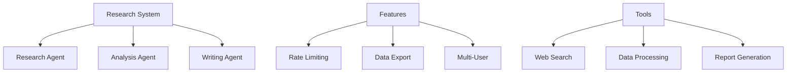

# LionAGI Cookbook

## Chapter 10: Building a Research Assistant

In previous chapters, you learned individual components. Now we'll combine them into a complete end-to-end project: a research assistant that:
- Gathers research data
- Analyzes information
- Generates reports
- Handles multiple users

### Prerequisites
- Completed [Chapter 9](ch9_data_adapter.md)
- Understanding of previous chapters
- Basic Python knowledge

## System Architecture

### Core Components


### Basic Setup
```python
from lionagi import (
    Branch, Model, Session,
    RateLimitedAPIExecutor,
    JsonFileAdapter, CSVFileAdapter,
    types
)
from datetime import datetime
from pathlib import Path
from typing import List, Dict, Any
import json

class ResearchSystem:
    """End-to-end research system."""
    def __init__(
        self,
        name: str = "Research",
        save_dir: str = "research",
        requests_per_minute: int = 60
    ):
        # Create session
        self.session = Session()
        
        # Create executor
        self.executor = RateLimitedAPIExecutor(
            queue_capacity=1000,
            capacity_refresh_time=60,
            limit_requests=requests_per_minute
        )
        
        # Create model
        self.model = Model(
            provider="openai",
            model="gpt-4",
            temperature=0.7,
            executor=self.executor
        )
        
        # Create agents
        self.researcher = self.session.new_branch(
            name="Researcher",
            system="""You are a research expert.
            Gather information effectively.
            Analyze data thoroughly.
            Find key insights."""
        )
        
        self.analyst = self.session.new_branch(
            name="Analyst",
            system="""You are a data analyst.
            Process information carefully.
            Identify patterns.
            Draw conclusions."""
        )
        
        self.writer = self.session.new_branch(
            name="Writer",
            system="""You are a technical writer.
            Write clear reports.
            Structure information.
            Explain concepts."""
        )
        
        # Configure models
        for branch in self.session.branches:
            branch.add_model(self.model)
        
        # Setup storage
        self.save_dir = Path(save_dir)
        self.save_dir.mkdir(exist_ok=True)
        
        # Track research
        self.topics: Dict[str, dict] = {}
        self.reports: Dict[str, dict] = {}
        self._load_research()
    
    def _load_research(self):
        """Load saved research."""
        for file in self.save_dir.glob("*.json"):
            with open(file) as f:
                research = json.load(f)
                if research["type"] == "topic":
                    self.topics[research["id"]] = research
                else:
                    self.reports[research["id"]] = research
    
    async def research_topic(
        self,
        topic: str,
        depth: str = "comprehensive",
        focus: List[str] = None
    ) -> dict:
        """Research new topic."""
        try:
            # Create research
            topic_id = f"topic_{len(self.topics)}"
            research = {
                "id": topic_id,
                "type": "topic",
                "topic": topic,
                "depth": depth,
                "focus": focus or [],
                "status": "researching",
                "timestamp": datetime.now().isoformat()
            }
            
            # Get research plan
            plan = await self.researcher.chat(
                f"""Create research plan for:
                Topic: {topic}
                Depth: {depth}
                Focus: {focus or 'General'}"""
            )
            
            # Get initial research
            findings = await self.researcher.chat(
                f"""Research following plan:
                {plan}"""
            )
            
            # Analyze findings
            analysis = await self.analyst.chat(
                f"""Analyze research findings:
                {findings}"""
            )
            
            # Update research
            research["plan"] = plan
            research["findings"] = findings
            research["analysis"] = analysis
            research["status"] = "completed"
            research["completed"] = datetime.now().isoformat()
            
            # Save research
            self.topics[topic_id] = research
            file_path = self.save_dir / f"{topic_id}.json"
            with open(file_path, "w") as f:
                json.dump(research, f, indent=2)
            
            return {
                "status": "success",
                "topic_id": topic_id,
                "research": research
            }
        
        except Exception as e:
            return {
                "status": "error",
                "error": str(e)
            }
    
    async def generate_report(
        self,
        topic_id: str,
        format: str = "markdown"
    ) -> dict:
        """Generate research report."""
        if topic_id not in self.topics:
            return {
                "status": "error",
                "error": f"Unknown topic: {topic_id}"
            }
        
        try:
            topic = self.topics[topic_id]
            
            # Create report
            report_id = f"report_{len(self.reports)}"
            report = {
                "id": report_id,
                "type": "report",
                "topic_id": topic_id,
                "format": format,
                "status": "generating",
                "timestamp": datetime.now().isoformat()
            }
            
            # Generate report
            content = await self.writer.chat(
                f"""Generate {format} report for:
                Topic: {topic['topic']}
                Findings: {topic['findings']}
                Analysis: {topic['analysis']}"""
            )
            
            # Update report
            report["content"] = content
            report["status"] = "completed"
            report["completed"] = datetime.now().isoformat()
            
            # Save report
            self.reports[report_id] = report
            file_path = self.save_dir / f"{report_id}.json"
            with open(file_path, "w") as f:
                json.dump(report, f, indent=2)
            
            # Export report
            if format == "json":
                JsonFileAdapter.to_obj(
                    content,
                    fp=self.save_dir / f"{report_id}_report.json"
                )
            elif format == "csv":
                CSVFileAdapter.to_obj(
                    content,
                    fp=self.save_dir / f"{report_id}_report.csv",
                    many=True
                )
            else:
                # Save as markdown
                with open(self.save_dir / f"{report_id}_report.md", "w") as f:
                    f.write(content)
            
            return {
                "status": "success",
                "report_id": report_id,
                "report": report
            }
        
        except Exception as e:
            return {
                "status": "error",
                "error": str(e)
            }
    
    def get_topic(
        self,
        topic_id: str
    ) -> dict:
        """Get topic details."""
        return self.topics.get(topic_id, {
            "error": f"Unknown topic: {topic_id}"
        })
    
    def get_report(
        self,
        report_id: str
    ) -> dict:
        """Get report details."""
        return self.reports.get(report_id, {
            "error": f"Unknown report: {report_id}"
        })

# Usage
async def research_ai():
    """Demo research system."""
    # Create system
    system = ResearchSystem(
        name="AI Research",
        save_dir="ai_research"
    )
    
    # Research topic
    result = await system.research_topic(
        topic="AI Safety",
        depth="comprehensive",
        focus=[
            "technical challenges",
            "current approaches",
            "future directions"
        ]
    )
    print("\nResearch:", result)
    
    # Generate report
    if result["status"] == "success":
        report = await system.generate_report(
            result["topic_id"],
            format="markdown"
        )
        print("\nReport:", report)

# Run research
asyncio.run(research_ai())
```

## Advanced Features

### Multi-User Support
```python
class ResearchService:
    """Multi-user research service."""
    def __init__(
        self,
        name: str = "ResearchService",
        save_dir: str = "research_service"
    ):
        # Create system
        self.system = ResearchSystem(
            name=name,
            save_dir=save_dir
        )
        
        # Track users
        self.users: Dict[str, dict] = {}
        self.requests: Dict[str, dict] = {}
    
    async def handle_request(
        self,
        user_id: str,
        request: dict
    ) -> dict:
        """Handle user request."""
        try:
            # Create request
            request_id = f"req_{len(self.requests)}"
            record = {
                "id": request_id,
                "user_id": user_id,
                "request": request,
                "status": "received",
                "timestamp": datetime.now().isoformat()
            }
            
            # Track user
            if user_id not in self.users:
                self.users[user_id] = {
                    "id": user_id,
                    "requests": []
                }
            self.users[user_id]["requests"].append(request_id)
            
            # Process request
            if request["type"] == "research":
                result = await self.system.research_topic(
                    topic=request["topic"],
                    depth=request.get("depth", "comprehensive"),
                    focus=request.get("focus")
                )
            elif request["type"] == "report":
                result = await self.system.generate_report(
                    topic_id=request["topic_id"],
                    format=request.get("format", "markdown")
                )
            else:
                return {
                    "status": "error",
                    "error": f"Unknown request: {request['type']}"
                }
            
            # Update request
            record["result"] = result
            record["status"] = "completed"
            record["completed"] = datetime.now().isoformat()
            
            # Save request
            self.requests[request_id] = record
            
            return {
                "status": "success",
                "request_id": request_id,
                "result": result
            }
        
        except Exception as e:
            return {
                "status": "error",
                "error": str(e)
            }
    
    def get_user_history(
        self,
        user_id: str
    ) -> dict:
        """Get user request history."""
        if user_id not in self.users:
            return {
                "error": f"Unknown user: {user_id}"
            }
        
        history = []
        for request_id in self.users[user_id]["requests"]:
            request = self.requests.get(request_id)
            if request:
                history.append(request)
        
        return {
            "user_id": user_id,
            "history": history
        }

# Usage
async def serve_users():
    """Demo research service."""
    # Create service
    service = ResearchService(
        name="Research Service",
        save_dir="research_data"
    )
    
    # Handle requests
    users = ["user1", "user2"]
    requests = [
        {
            "type": "research",
            "topic": "Machine Learning",
            "depth": "basic",
            "focus": ["fundamentals", "applications"]
        },
        {
            "type": "research",
            "topic": "Deep Learning",
            "depth": "comprehensive",
            "focus": ["architectures", "training"]
        }
    ]
    
    # Process each request
    results = []
    for user_id, request in zip(users, requests):
        result = await service.handle_request(
            user_id,
            request
        )
        results.append(result)
        print(f"\nUser {user_id} result:", result)
        
        # Generate report if successful
        if result["status"] == "success":
            topic_id = result["result"]["topic_id"]
            report = await service.handle_request(
                user_id,
                {
                    "type": "report",
                    "topic_id": topic_id,
                    "format": "markdown"
                }
            )
            print(f"\nUser {user_id} report:", report)
    
    # Check history
    for user_id in users:
        history = service.get_user_history(user_id)
        print(f"\nUser {user_id} history:", history)

# Run service
asyncio.run(serve_users())
```

## Best Practices

1. **System Design**
   - Define clear interfaces
   - Handle errors gracefully
   - Track state properly
   - Monitor performance

2. **Service Design**
   - Support multiple users
   - Track requests
   - Maintain history
   - Handle concurrency

3. **Integration**
   - Use rate limiting
   - Export data cleanly
   - Log operations
   - Monitor health

## Quick Reference
```python
from lionagi import Branch, Model, Session

# Create system
session = Session()
researcher = session.new_branch(
    name="Researcher",
    system="You are a researcher."
)

# Configure model
model = Model(provider="openai")
researcher.add_model(model)

# Research topic
result = await researcher.chat(
    "Research AI Safety"
)
```

## Next Steps

You've learned:
- How to build complete systems
- How to handle multiple users
- How to manage research
- How to generate reports

In [Chapter 11](ch11_performance.md), we'll explore performance optimization and scaling strategies.
