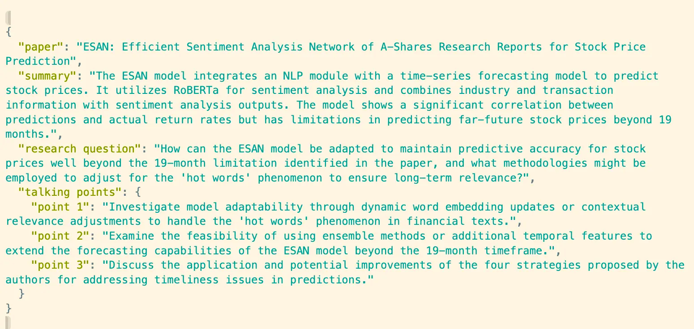

Auto Explorative Research: LionAGI + RAG with LlamaIndex
========================================================

In this example, we will explore auto explorative research with LionAGI and `LlamaIndex <https://www.llamaindex.ai/>`_
`VectorIndex <https://docs.llamaindex.ai/en/stable/understanding/indexing/indexing.html>`_
`Query Engine <https://docs.llamaindex.ai/en/stable/understanding/querying/querying.html>`_. The process involves
downloading papers from ArXiv, embedding them, and utilizing our ``Session`` to cross-reference the Index for
clarification when needed.

.. code-block:: python

   %pip install lionagi llama_index

.. code-block:: python

   # topic to research on
   query = 'Large Language Model Time Series Analysis'

   # where to save output
   dir = "data/log/researcher/"

   # build the index with 20 articles, but we will only read into 5 we like
   num_papers = 20

First, let's build a Vector Index with `LlamaIndex <https://www.llamaindex.ai/>`_

.. code-block:: python

   from llama_index import download_loader, ServiceContext, VectorStoreIndex
   from llama_index.llms import OpenAI
   from llama_index.node_parser import SentenceSplitter

   ArxivReader = download_loader("ArxivReader")
   loader = ArxivReader()
   node_parser = SentenceSplitter(chunk_size=800, chunk_overlap=50)

   # let us download some papers from arvix
   documents, abstracts = loader.load_papers_and_abstracts(search_query=query, max_results=num_papers)
   nodes = node_parser.get_nodes_from_documents(documents, show_progress=False)

   # set up index object
   llm = OpenAI(temperature=0.1, model="gpt-4-1106-preview")
   service_context = ServiceContext.from_defaults(llm=llm)
   index1 = VectorStoreIndex(nodes, include_embeddings=True, service_context=service_context)

   # set up query engine
   query_engine = index1.as_query_engine(include_text=False, response_mode="tree_summarize")

The query engine is set up and ready, we can proceed to write the tool description following the OpenAI schema.

.. code-block:: python

   tools = [
        {
            "type": "function",
            "function": {
                "name": "query_arxiv_papers",
                "description": """
                               Perform a query to a QA bot with access to an
                               index built with papers from arxiv
                               """,
                "parameters": {
                    "type": "object",
                    "properties": {
                        "str_or_query_bundle": {
                            "type": "string",
                            "description": "a question to ask the QA bot",
                        }
                    },
                    "required": ["str_or_query_bundle"],
                },
            }
        }
   ]

   # we will need to register both the function description
   # and actual implementation
   func = query_engine.query

Central to LionAGI’s power is its facilitation of sophisticated workflow manipulation. Let’s explore how to craft
prompts and set up a session for an automated research assistant.

.. code-block:: python

   # a rigidly set up prompt can help make outcome more deterministic
   # though any string will work as well.
   system = {
        "persona": "a helpful world-class researcher",
        "requirements": """
                think step by step before returning a clear, precise
                worded answer with a humble yet confident tone
                """,
        "responsibilities": f"""
                you are asked to help with researching on the topic
                of {query}
                """,
        "tools": "provided with a QA bot for grounding responses"
   }

   # similarly, we can pass in any string or dictionary to instruction
   # here we are modifying model behavior by telling mdel how to output
   deliver_format1 = {"return required": "yes", "return format": "paragraph"}

   deliver_format2 = {"return required": "yes",
        "return format": {
            "json_mode": {
                'paper': "paper_name",
                "summary": "...",
                "research question": "...",
                "talking points": {
                    "point 1": "...",
                    "point 2": "...",
                    "point 3": "..."
                }}}}

   function_call = {
     "notice":f"""
        At each task step, identified by step number, you must use the tool
        at least twice. Notice you are provided with a QA bot as your tool,
        the bot has access to the {num_papers} papers via a queriable index
        that takes natural language query and return a natural language
        answer. You can decide whether to invoke the function call, you will
        need to ask the bot when there are things need clarification or
        further information. you provide the query by asking a question,
        please use the tool as extensively as you can.
       """
   }

   # here we create a two step process imitating the steps human would take to
   # perform the research task
   instruct1 = {
        "task step": "1",
        "task name": "read paper abstracts",
        "task objective": "get initial understanding of the papers of interest",
        "task description": """
                provided with abstracts of paper, provide a brief summary
                highlighting the paper core points, the purpose is to extract
                as much information as possible
                """,
        "deliverable": deliver_format1
   }

   instruct2 = {
        "task step": "2",
        "task name": "propose research questions and talking points",
        "task objective": "initial brainstorming",
        "task description": """
            from the improved understanding of the paper, please propose
            an interesting, unique and practical research question,
            support your reasoning. Kept on asking questions if things are
            not clear.
            """,
        "deliverable": deliver_format2,
        "function calling": function_call
   }

Next, we define and run the workflow that will manage our research session:

.. code-block:: python

   # Research Assistant Workflow
   import lionagi as li

   # read an abstract, then check against a vector store of papers, and suggest
   # new research topics
   async def read_propose(context, num=5):

        # Instantiate a Session with the system message and directory to save
        # the outputs
        researcher = li.Session(system, dir=dir)

        # Register tools needed for the Session
        # tools are the OpenAI schema,
        researcher.register_tools(tools=tools,
                                  funcs=func)

        # Initiate the research process by sending the first set of instructions
        await researcher.initiate(instruction=instruct1,
                context=context, temperature=0.7)

        # Use auto_followup to conduct a sequence of interactions
        # tool parser is needed for automatically using tools many times.
        # the accepted final formats are string and dict
        await researcher.auto_followup(instruction=instruct2,
                tools=tools, num=num, tool_parser=lambda x: x.response)

        # Save messages and logs from the session to CSV
        researcher.messages_to_csv()
        researcher.log_to_csv()

        # Return the latest message from the conversation
        return researcher.conversation.messages[-1]['content']

With asynchronous programming, executing this workflow becomes a breeze:

.. code-block:: python

   # we use 5 articles as our papers of interest for the researcher session to
   # look into
   abstracts = [x.text for x in abstracts][8:13]

   # Running the workflow coroutine for each abstract using li.al_call
   outs = await li.al_call(abstracts, read_propose)

.. code-block:: python
   from IPython.display import Markdown

   Markdown(out1[1])

.. [Ref] Tuo Sun, Wanrong Zheng, Shufan Yu, Mengxun Li, Jiarui Ou.
   “ESAN: Efficient Sentiment Analysis Network of A-Shares Research Reports for Stock Price Prediction.”
   `arXiv:2112.11444 <https://arxiv.org/abs/2112.11444>`_
