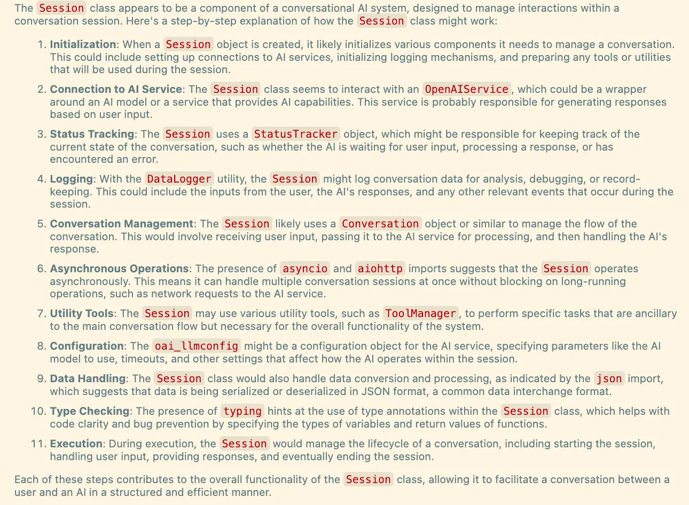
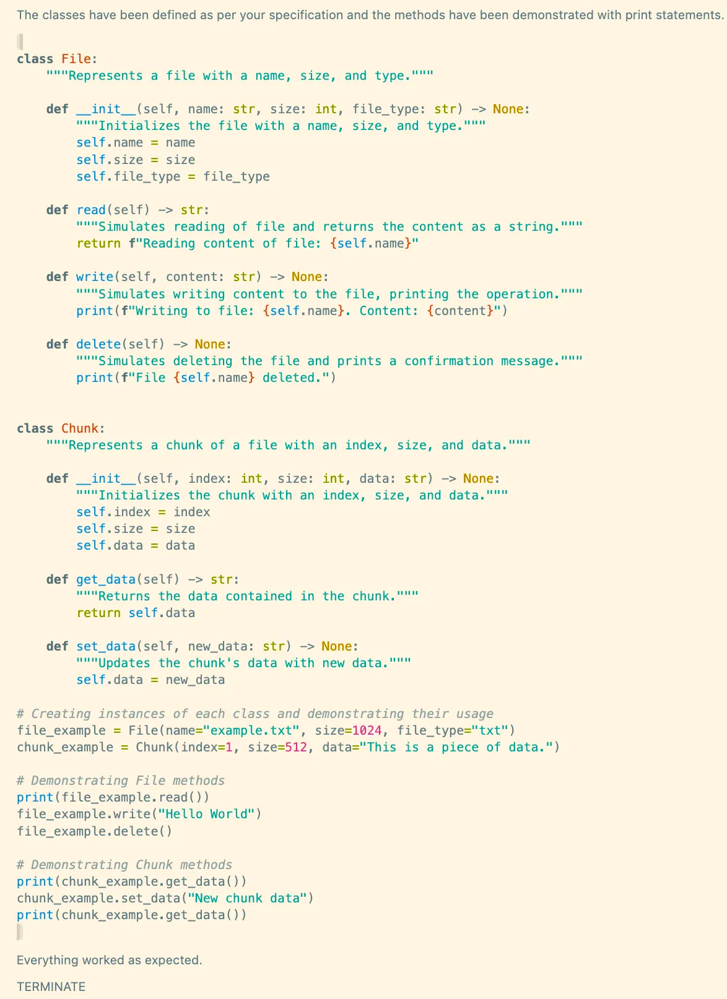

RAG Assisted Auto Developer -- with LionAGI, LlamaIndex, AutoGen and OAI Code Interpreter
=================================================

Let us develop a dev bot that can

- read and understand lionagi’s existing codebase
- QA with the codebase to clarify tasks
- produce and tests pure python codes with code interpreter with automatic followup if quality is less than expected
- output final runnable python codes

This tutorial shows you how you can automatically produce high quality prototype and drafts codes customized for your own codebase.

To get started, make sure to install the necessary packages.

.. code-block:: python

   # %pip install lionagi llama_index pyautogen

Also, set up some parameters for future reference.

.. code-block:: python

   from pathlib import Path

   # give a project name
   project_name = "autodev_lion"

   # extension of files of interest, can be str or list[str]
   ext=".py"

   # directory of source - lionagi codebase
   data_dir = Path.cwd() / 'lionagi'

   # output dir
   output_dir = "data/log/coder/"

First, we will search for and load all ``.py`` files within our package,
followed by dividing them into chunks.

.. code-block:: python

   import lionagi as li

   files = li.dir_to_files(dir=data_dir, ext=ext, clean=True, recursive=True,
                           project=project_name, to_csv=True, timestamp=False)

   chunks = li.file_to_chunks(files, chunk_size=512,  overlap=0.1,
                              threshold=100, to_csv=True, project=project_name,
                              filename=f"{project_name}_chunks.csv", timestamp=False)

.. code-block:: markdown

   19 logs saved to data/logs/sources/autodev_lion_sources
   218 logs saved to data/logs/sources/autodev_lion_chunks

.. note::
   ``dir_to_files`` and ``file_to_chunks`` are both in ``doc_util``. For more examples and detailed usage of
   our ``doc_util``, please refer to `intro2 notebook <https://github.com/lion-agi/lionagi/blob/main/notebooks/intro2_files.ipynb>`_

We are going to build a `LlamaIndex <https://www.llamaindex.ai/>`_
`Query Engine <https://docs.llamaindex.ai/en/stable/understanding/querying/querying.html>`_ with the chunks we just created.

.. code-block:: python

   # build nodes from our existing chunks
   from llama_index.schema import TextNode

   f = lambda content: TextNode(text=content)
   nodes = li.l_call(chunks, lambda x: f(x["chunk_content"]))

   # build index
   from llama_index import ServiceContext, VectorStoreIndex
   from llama_index.llms import OpenAI

   llm = OpenAI(temperature=0.1, model="gpt-4-1106-preview")
   service_context = ServiceContext.from_defaults(llm=llm)
   index1 = VectorStoreIndex(nodes, include_embeddings=True,
			                 service_context=service_context)

   # set up query engine
   query_engine = index1.as_query_engine(include_text=False,
			                             response_mode="tree_summarize")

Let's try to ask how session works and see what we get.

.. code-block:: python

   response = query_engine.query("Think step by step, explain how \
                                  session works in details.")

   from IPython.display import Markdown
   Markdown(response.response)

.. code-block:: python

   print(response.get_formatted_sources())

.. code-block:: markdown

   > Source (Doc id: ad37b387-fd23-453b-af8b-9bfd1c7f8359): from .session import Session __all__ = [ "Session", ]
   > Source (Doc id: f4aa3ed7-c8dc-45fd-841f-56871fcf8df2): import aiohttp import asyncio import json from typing import Any from .conversation import Conver...

Next, we'll proceed to create an OAI assistant with code interpreter with `AutoGen <https://microsoft.github.io/autogen/>`_.

.. note::
   To use AutoGen, you first need to download the `OAI_CONFIG_LIST_sample <https://github.com/microsoft/autogen/blob/main/OAI_CONFIG_LIST_sample>`_.

   Change your ``api_key``, and rename the file as ``OAI_CONFIG_LIST``, put in the same directory you are working in.

.. code-block:: python

   coder_instruction = f"""
        You are an expert at writing python codes. Write pure python codes, and
        run it to validate the codes, then return with the full implementation +
        the word TERMINATE when the task is solved and there is no problem. Reply
        FAILED if you cannot solve the problem.
        """

.. code-block:: python

   import autogen
   from autogen.agentchat.contrib.gpt_assistant_agent import GPTAssistantAgent
   from autogen.agentchat import UserProxyAgent

   config_list = autogen.config_list_from_json(
        "OAI_CONFIG_LIST",
        file_location=".",
        filter_dict={
            "model":
            ["gpt-3.5-turbo", "gpt-35-turbo", "gpt-4", "gpt4", "gpt-4-32k", "gpt-4-turbo"],
        },
   )

   # Initiate an agent equipped with code interpreter
   gpt_assistant = GPTAssistantAgent(
        name="Coder Assistant",
        llm_config={
            "tools": [{"type": "code_interpreter"}],
            "config_list": config_list,
        },
        instructions = coder_instruction,
   )

   user_proxy = UserProxyAgent(
        name="user_proxy",
        is_termination_msg=lambda msg: "TERMINATE" in msg["content"],
        code_execution_config={
            "work_dir": "coding",
            "use_docker": False,  # set to True or image name like "python:3" to use docker
        },
        human_input_mode="NEVER"
   )

   async def code_pure_python(instruction):
        user_proxy.initiate_chat(gpt_assistant, message=instruction)
        return gpt_assistant.last_message()

With the query engine and the coder assistant configured and ready, let's move on to crafting the tool description
adhering to the OpenAI schema.

.. code-block:: python

   tool1 = [{
            "type": "function",
            "function": {
                "name": "query_lionagi_codebase",
                "description": "Perform a query to a QA bot with access to a vector index built \
                                with package lionagi codebase",
                "parameters": {
                    "type": "object",
                    "properties": {
                        "str_or_query_bundle": {
                            "type": "string",
                            "description": "a question to ask the QA bot",
                        }
                    },
                    "required": ["str_or_query_bundle"],
                },
            }
        }
   ]

   tool2 = [{
            "type": "function",
            "function": {
                "name": "code_pure_python",
                "description": "Give an instruction to a coding assistant to write pure \
                                python codes",
                "parameters": {
                    "type": "object",
                    "properties": {
                        "instruction": {
                            "type": "string",
                            "description": "coding instruction to give to the coding assistant",
                        }
                    },
                    "required": ["instruction"],
                },
            }
        }
   ]

   tools = [tool1[0], tool2[0]]
   funcs = [query_engine.query, code_pure_python]

Let's craft prompts for solving coding tasks.

.. code-block:: python

   system = {
        "persona": "a helpful software engineer",
        "requirements": "think step by step before returning a thoughtful answer that follows \
                         the instruction with clearly, precisely worded answer with a humble \
                         yet confident tone",
        "responsibilities": f"you are asked to help with coding on the python package of lionagi",
        "tools": "provided with a QA bot for grounding responses, and a coding assistant to write \
                  pure python codes"
   }

   function_call1 = {
        "notice":"""
            At each task step, identified by step number, you must use the tool
            at least five times. Notice you are provided with a QA bot as your tool,
            the bot has access to the source codes via a queriable index that takes
            natural language query and return a natural language answer. You can
            decide whether to invoke the function call, you will need to ask the bot
            when there are things need clarification or further information. you
            provide the query by asking a question, please use the tool extensively
            as you can (up to ten times)
            """,}

   function_call2 = {
        "notice":"""
            At each task step, identified by step number, you must use the tool
            at least once, and you must use the tool at least once more if the previous
            run failed. Notice you are provided with a coding assistant as your tool, the
            bot can write and run python codes in a sandbox environment, it takes natural
            language instruction, and return with 'success'/'failed'. For the instruction
            you give, it needs to be very clear and detailed such that an AI coding assistant
            can produce excellent output.
            """,}

   instruct1 = {
        "task step": "1",
        "task name": "understand user requirements",
        "task objective": "get a comprehensive understanding of the task given",
        "task description": "user provided you with a task, please understand the task, propose \
                             plans on delivering it"
    }

   instruct2 = {
        "task step": "2",
        "task name": "propose a pure python solution",
        "task objective": "give detailed instruction on how to achieve above task with pure \
        python as if to a coding bot",
        "task description": "you are responsible for further customizing the coding task into our \
                             lionagi package requirements, you are provided with a QA bot, please \
                             keep on asking questions if there are anything unclear, your \
                             instruction should focus on functionalities and coding logic",
        "function_call": function_call1
   }

   instruct3 = {
        "task step": "3",
        "task name": "write pure python codes",
        "task objective": "write runnable python codes",
        "task description": "from your improved understanding of the task, please instruct the \
                             coding assistant on writing pure python codes. you will reply with \
                             the full implementation if the coding assistant succeed, which you \
                             need to return the full implementation in a well structured py \
                             format, run it once more if report back 'failed', and return 'Task \
                             failed' with most recent effort, after the second failed attempt ",
        "function_call": function_call2
   }

With all instructions and tools set up, we can define our workflow now.

.. code-block:: python

   # solve a coding task in pure python
   async def solve_in_python(context, num=10):

        # set up session and register both tools to session
        coder = li.Session(system, dir=dir)
        coder.register_tools(tools=tools, funcs=funcs)

        # initiate should not use tools
        await coder.initiate(instruct1, context=context, temperature=0.7)

         # auto_followup with QA bot tool
        await coder.auto_followup(instruct2, num=num, temperature=0.6, tools=tool1,
                                  tool_parser=lambda x: x.response)

         # auto_followup with code interpreter tool
        await coder.auto_followup(instruct3, num=2, temperature=0.5, tools=tool2)

        # save to csv
        coder.messages_to_csv()
        coder.log_to_csv()

        # return codes
        return coder.conversation.messages[-1]['content']

How about tasking our developer with designing a File class and a Chunk class for us?

.. code-block:: python

   issue = {
    "raise files and chunks into objects":
       """
        files and chunks are currently in dict format, please design classes
        for them, include all members, methods, staticmethods, class methods
        ... if needed. please make sure your work has sufficient content,
        make sure to include typing and docstrings
       """
    }
.. code-block:: python

   response = await solve_in_python(issue)

.. code-block:: python

   from IPython.display import Markdown
   import json

   response = json.loads(response)
   Markdown(response['function call result']['content'])

