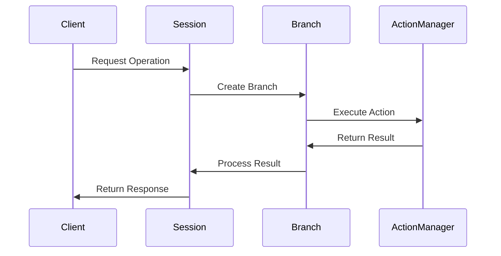
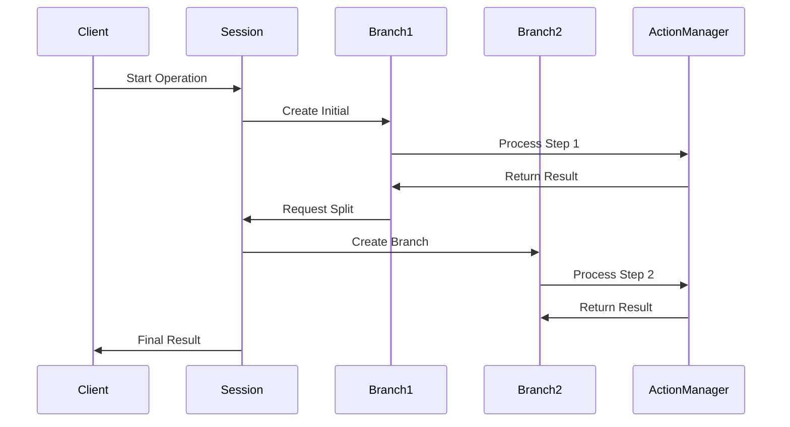

# LionAGI Action System

## System Overview

The Action System serves as the core execution framework within LionAGI, providing:
- Function execution and tool management
- Observability and state tracking
- Type-safe processing pipelines
- Robust error handling and recovery

## Architectural Layers

### 1. Session Layer (Coordination)
**Purpose**: High-level orchestration and resource management
- Session lifecycle management
- Branch coordination
- Resource allocation
- State synchronization

### 2. Branch Layer (Processing)
**Purpose**: Core processing and conversation management
- Message handling
- Action execution
- Operation control
- Model integration

### 3. Action Layer (Execution)
**Purpose**: Tool management and execution
- Tool registration and validation
- Schema management
- Action execution
- Result processing

### 4. Operation Layer (Control)
**Purpose**: Workflow and validation control
- Step processing
- Validation management
- Model interaction
- Result handling

## Core Components

### 1. Base Action
```python
class BaseAction:
    """Foundation for observable actions"""
    def __init__(self):
        self.state = EventState()
        self.resources = ResourceManager()
        
    async def execute(self):
        """Execute with full lifecycle tracking"""
        try:
            await self.pre_execute()
            result = await self._execute()
            await self.post_execute()
            return result
        except Exception as e:
            await self.handle_error(e)
```

### 2. Action Manager
```python
class ActionManager:
    """Central orchestration system"""
    def __init__(self):
        self.registry = {}
        self.validator = SchemaValidator()
        
    def register_tool(self, tool: Tool):
        """Register tool with validation"""
        schema = self.validator.validate_tool(tool)
        self.registry[tool.name] = (tool, schema)
        
    async def invoke(self, action: str, **params):
        """Execute registered action"""
        tool = self.get_tool(action)
        await self.validate_params(tool, params)
        return await tool.execute(**params)
```

### 3. Tool System
```python
class Tool:
    """Enhanced function wrapper"""
    def __init__(self, func: Callable):
        self.func = func
        self.schema = self.generate_schema()
        
    def generate_schema(self) -> dict:
        """Generate JSON schema from function"""
        return create_schema_from_function(self.func)
        
    async def execute(self, **params):
        """Execute with pipeline processing"""
        validated = self.validate(params)
        return await self.process_pipeline(validated)
```

## Integration Patterns

### 1. Basic Tool Registration
```python
# Register tool with manager
async def setup_tools(branch):
    @tool
    async def process_data(data: dict) -> dict:
        """Process input data"""
        return await process(data)
        
    branch.acts.register_tool(process_data)
```

### 2. Complex Workflow
```python
class WorkflowManager:
    def __init__(self, session):
        self.session = session
        
    async def execute_workflow(self, steps):
        branch = await self.session.new_branch()
        
        for step in steps:
            operative = step.create_operative()
            result = await branch.operate(
                instruction=step.instruction,
                operative_model=operative
            )
            
            if result.needs_refinement:
                branch = await self.refine_result(branch, result)
```

### 3. State Management
```python
class StateManager:
    """Manage state across branches"""
    def __init__(self, session):
        self.session = session
        
    def sync_state(self, source, targets):
        """Synchronize state across branches"""
        state = self.extract_state(source)
        for target in targets:
            self.apply_state(target, state)
```

## System Workflows

### 1. Basic Operation Flow


### 2. Complex Operation Flow


## Best Practices

### 1. Development Guidelines
- Use type hints consistently
- Implement proper error handling
- Follow async patterns
- Maintain resource cleanup
- Document clearly

### 2. Error Handling
```python
class ErrorBoundary:
    async def execute_with_recovery(self, action):
        try:
            return await action.execute()
        except RecoverableError as e:
            return await self.recover(action, e)
        except CriticalError as e:
            await self.handle_critical(e)
```

### 3. Resource Management
```python
class ResourceManager:
    def __init__(self):
        self.active = set()
        self.pool = ResourcePool()
        
    async def acquire(self, resource):
        """Acquire with tracking"""
        await self.pool.get(resource)
        self.active.add(resource)
        
    async def release(self, resource):
        """Release with cleanup"""
        await self.pool.release(resource)
        self.active.remove(resource)
```

## Performance Optimization

### 1. Connection Management
- Use connection pooling
- Implement request batching
- Handle timeouts properly
- Monitor connection health

### 2. Resource Utilization
- Optimize memory usage
- Implement proper cleanup
- Monitor resource limits
- Use efficient data structures

### 3. Async Optimization
- Use proper concurrency
- Implement batching
- Handle backpressure
- Monitor task queues

## Security Considerations

### 1. Access Control
- Implement proper permissions
- Validate all inputs
- Sanitize outputs
- Monitor usage

### 2. Data Protection
- Encrypt sensitive data
- Implement proper cleanup
- Handle secrets securely
- Audit access patterns

## Monitoring & Debugging

### 1. System Health
- Track operation metrics
- Monitor resource usage
- Log error patterns
- Measure performance

### 2. Debug Tools
- Implement logging
- Track state changes
- Monitor workflows
- Enable tracing

## References and Resources
- [LionAGI Documentation](https://ocean-lion.com/Welcome)
- [Python AsyncIO Guide](https://docs.python.org/3/library/asyncio.html)
- [Pydantic Documentation](https://pydantic-docs.helpmanual.io/)
