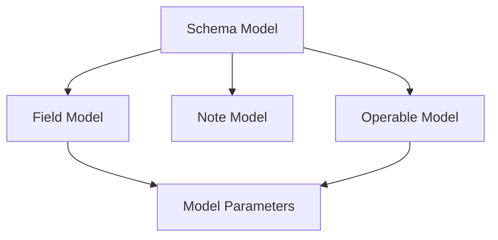

# Models System MOC

## Overview

The LionAGI Models System provides a comprehensive framework for building and managing sophisticated data models. Built on Pydantic, it extends the base functionality with:

1. Schema Management
   - Type-safe field definitions
   - Validation rules
   - Model configuration
   - Documentation support

2. Dynamic Fields
   - Runtime field addition
   - Field modification
   - Field removal
   - State tracking

3. Nested Data
   - Deep access
   - Path navigation
   - Update operations
   - Data transformation

4. Model Generation
   - Dynamic creation
   - Field configuration
   - Inheritance control
   - Validation setup

## Core Components

### Base Layer

#### Schema Model
- [[Schema Model API Reference]] - Base schema functionality
- Core validation system
- Model configuration
- Schema management
- Type safety
- Hash computation

#### Field Model
- [[Field Model]] - Field definition system
- Field validation
- Documentation
- Type annotations
- Default values
- Validator configuration

### Enhanced Layer

#### Note Model
- [[Note API Reference]] - Nested data structure
- Deep access patterns
- Dictionary interface
- Flattening support
- Update operations
- Path navigation

#### Operable Model
- [[Operable Model API Reference]] - Dynamic field management
- Runtime modification
- Attribute tracking
- Field operations
- State management
- Type safety

### Generation Layer

#### Model Parameters
- [[Model Params API Reference]] - Model generation
- Dynamic creation
- Field configuration
- Inheritance control
- Validation setup
- Documentation

## System Architecture

### Component Dependencies



### Layer Organization

1. Base Layer
   - Schema validation
   - Type system
   - Field definitions
   - Core operations

2. Enhanced Layer
   - Nested structures
   - Dynamic fields
   - State management
   - Advanced operations

3. Generation Layer
   - Model creation
   - Configuration
   - Inheritance
   - Documentation

### Cross-System Integration

1. Type System
   - Type annotations
   - Validation rules
   - Conversion logic
   - Safety checks

2. Validation System
   - Field validation
   - Model validation
   - Error handling
   - State verification

3. Documentation System
   - Field descriptions
   - Model docstrings
   - Usage examples
   - API references

## Common Workflows

### Model Creation

1. Schema Definition
```python
# Base model with validation
class UserModel(SchemaModel):
    name: str
    age: int = Field(ge=0)
    email: str | None = None
```

2. Field Configuration
```python
# Rich field definitions
name_field = FieldModel(
    name="name",
    annotation=str,
    description="User's full name",
    validator=validate_name
)

age_field = FieldModel(
    name="age",
    annotation=int,
    default=0,
    validator=lambda v: v if v >= 0 else 0
)
```

3. Dynamic Generation
```python
# Model generation with configuration
params = ModelParams(
    name="UserModel",
    field_models=[name_field, age_field],
    doc="User model with validation",
    frozen=True
)

UserModel = params.create_new_model()
```

### Data Handling

1. Nested Operations
```python
# Deep data access
note = Note(
    user={
        "name": "John",
        "settings": {
            "theme": "dark",
            "notifications": True
        }
    }
)

# Get nested value
theme = note.get(["user", "settings", "theme"])

# Update nested value
note.update(["user", "settings"], {"language": "en"})

# Remove nested value
old_theme = note.pop(["user", "settings", "theme"])
```

2. Dynamic Fields
```python
# Runtime field management
model = OperableModel()

# Add field
model.add_field(
    "status",
    value="active",
    annotation=str,
    description="User status"
)

# Update field
model.update_field(
    "status",
    value="inactive",
    validator=validate_status
)

# Remove field
model.remove_field("status")
```

3. Field Operations
```python
# Field attribute management
model = OperableModel()

# Set attributes
model.field_setattr(
    "name",
    "description",
    "User's full name"
)

# Get attributes
desc = model.field_getattr(
    "name",
    "description",
    default="Name field"
)

# Check attributes
has_desc = model.field_hasattr(
    "name",
    "description"
)
```

## Integration Points

### Core Systems

1. Type System
   - Type annotations
   - Validation rules
   - Conversion logic
   - Safety checks
   ```python
   # Type-safe field
   field = FieldModel(
       name="count",
       annotation=int,
       validator=lambda v: abs(v)
   )
   ```

2. Validation System
   - Field validation
   - Model validation
   - Error handling
   - State verification
   ```python
   # Validation rules
   class UserModel(SchemaModel):
       name: str = Field(min_length=2)
       age: int = Field(ge=0, le=120)
       email: str = Field(regex=r"[^@]+@[^@]+\.[^@]+")
   ```

3. Serialization System
   - Model conversion
   - Data export
   - Format handling
   - State preservation
   ```python
   # Model serialization
   user_dict = user.to_dict()
   user_copy = UserModel.from_dict(user_dict)
   ```

### Cross-System Integration

1. Message System
   - Model definitions
   - Data validation
   - Field tracking
   - Type safety
   ```python
   # Message model
   class Message(SchemaModel):
       content: str
       timestamp: datetime
       metadata: dict[str, Any]
   ```

2. Action System
   - Function parameters
   - Return types
   - Validation rules
   - Error handling
   ```python
   # Action model
   class Action(SchemaModel):
       name: str
       params: dict[str, Any]
       result: Any | None = None
   ```

3. Graph System
   - Node models
   - Edge models
   - Property validation
   - Data integrity
   ```python
   # Graph models
   class Node(SchemaModel):
       id: str
       properties: dict[str, Any]
       edges: list[Edge] = []
   ```

## Best Practices

### Model Design

1. Schema Definition
   - Clear field names
   - Appropriate types
   - Validation rules
   - Documentation
   ```python
   class UserProfile(SchemaModel):
       """User profile with validation and documentation."""
       
       id: str = Field(
           description="Unique user identifier",
           regex=r"^usr_[a-z0-9]{32}$"
       )
       
       name: str = Field(
           description="User's full name",
           min_length=2,
           max_length=100
       )
       
       email: str = Field(
           description="User's email address",
           regex=r"[^@]+@[^@]+\.[^@]+",
           example="user@example.com"
       )
   ```

2. Field Configuration
   - Type safety
   - Default values
   - Validation rules
   - Clear descriptions
   ```python
   status_field = FieldModel(
       name="status",
       annotation=str,
       default="active",
       validator=validate_status,
       description="User account status",
       examples=["active", "inactive", "suspended"]
   )
   ```

3. Model Generation
   - Inheritance planning
   - Field organization
   - Validation setup
   - Documentation
   ```python
   params = ModelParams(
       name="ExtendedUser",
       base_type=BaseUser,
       field_models=[
           status_field,
           settings_field
       ],
       doc="Extended user model with additional fields",
       frozen=True
   )
   ```

### Data Handling

1. Nested Structures
   - Path clarity
   - Error handling
   - Default values
   - Update strategy
   ```python
   # Clear path structure
   settings = note.get(
       ["user", "preferences", "theme"],
       default="light"
   )
   
   # Safe updates
   try:
       note.update(
           ["user", "preferences"],
           {"language": "en"}
       )
   except KeyError:
       note.set(
           ["user", "preferences"],
           {"language": "en"}
       )
   ```

2. Dynamic Fields
   - Type safety
   - Validation rules
   - State tracking
   - Cleanup
   ```python
   # Safe field management
   model = OperableModel()
   
   # Add with validation
   model.add_field(
       "count",
       value=0,
       annotation=int,
       validator=lambda v: max(0, v)
   )
   
   # Update with type check
   model.update_field(
       "count",
       value=10,
       field_obj=Field(ge=0)
   )
   
   # Clean removal
   model.remove_field("count")
   ```

3. Field Operations
   - Safe access
   - Error handling
   - State management
   - Type checking
   ```python
   # Safe attribute operations
   if model.field_hasattr("name", "description"):
       desc = model.field_getattr(
           "name",
           "description",
           default="No description"
       )
   
   # Type-safe updates
   model.field_setattr(
       "age",
       "validator",
       lambda v: max(0, min(120, v))
   )
   ```

## Implementation References

### Core Components
- [[Schema Model API Reference]] - Base functionality
- [[Field Model]] - Field system
- [[Model Params API Reference]] - Model generation
- [[Note API Reference]] - Nested data
- [[Operable Model API Reference]] - Dynamic fields

### Related Systems
- [[Type API Reference]] - Type system
- [[Validation API Reference]] - Validation
- [[Serialization API Reference]] - Data conversion

### External References
- [[Pydantic API Reference]] - Base models
- [[Python Type API Reference]] - Type hints
- [[JSON Schema API Reference]] - Schema system
