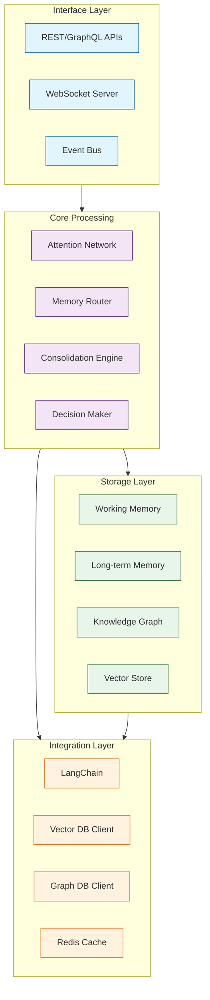
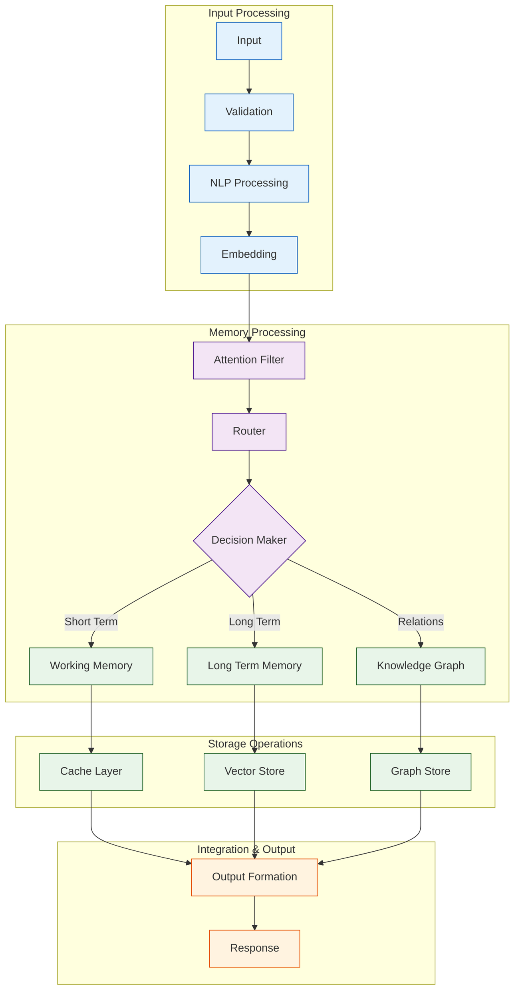
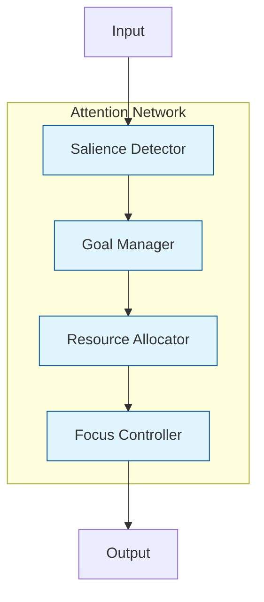
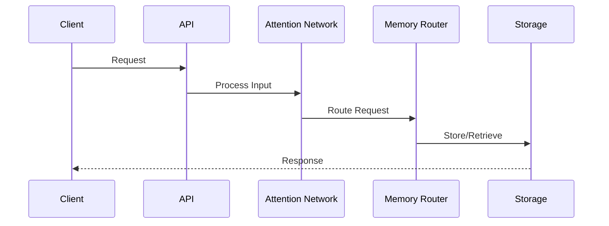
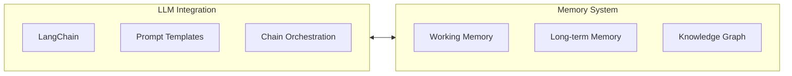
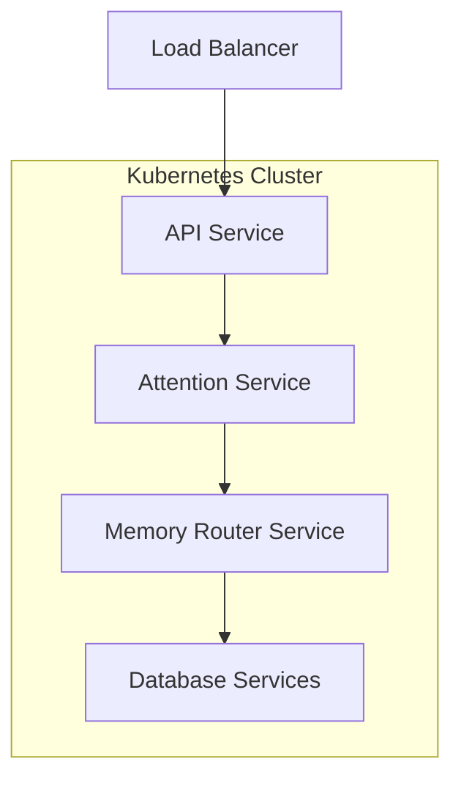

# Neural Memory System Architecture
Version: 1.0
Last Updated: 2024-12-17

## Table of Contents
1. [System Overview](#1-system-overview)
2. [Architecture Overview](#2-architecture-overview)
3. [Component Architecture](#3-component-architecture)
4. [Data Flow Architecture](#4-data-flow-architecture)
5. [Storage Architecture](#5-storage-architecture)
6. [Integration Architecture](#6-integration-architecture)
7. [Deployment Architecture](#7-deployment-architecture)
8. [Technical Specifications](#8-technical-specifications)

## 1. System Overview

### 1.1 Purpose
A neuroscience-inspired memory system for LLMs that provides:
- Multi-modal information processing
- Cognitive architecture integration
- Advanced attention mechanisms
- Knowledge integration and consolidation

### 1.2 Key Features
- Hierarchical memory organization
- Attention-based processing
- Dynamic knowledge integration
- Cognitive-inspired decision making

## 2. Architecture Overview

### 2.1 High-Level System Architecture


### 2.2 Data Flow Architecture


## 3. Component Architecture

### 3.1 Attention Network


### 3.2 Memory Router
```python
class MemoryRouter:
    """Routes memory operations to appropriate storage systems"""
    
    def __init__(self):
        self.working_memory = WorkingMemory()
        self.long_term_memory = LongTermMemory()
        self.knowledge_graph = KnowledgeGraph()
        self.decision_maker = DecisionEngine()
    
    async def route_operation(self, operation: MemoryOperation) -> RoutingResult:
        # Implementation details as in pseudocode
        pass
```

## 4. Data Flow Architecture

### 4.1 Memory Operations Flow


## 5. Storage Architecture

### 5.1 Storage Components
- **Working Memory**
  ```python
  class WorkingMemoryItem:
      key: str
      value: Any
      ttl: int
      priority: float
  ```

- **Long-term Memory**
  ```python
  class LTMItem:
      id: str
      content: Any
      embedding: Vector
      metadata: Dict
  ```

- **Knowledge Graph**
  ```python
  class GraphNode:
      id: str
      type: str
      properties: Dict
  ```

## 6. Integration Architecture

### 6.1 LLM Integration


## 7. Deployment Architecture

### 7.1 Container Architecture


## 8. Technical Specifications

### 8.1 Technology Stack
- **Runtime**: Python 3.11+
- **API Framework**: FastAPI
- **Event Bus**: Kafka
- **Databases**:
  - Vector Store: Milvus/Qdrant
  - Graph Database: Neo4j
  - Cache: Redis

### 8.2 API Specifications
```python
class MemoryAPI:
    """Main API interface"""
    
    async def store_memory(self, content: Any) -> MemoryResponse:
        pass
    
    async def retrieve_memory(self, query: str) -> MemoryResponse:
        pass
    
    async def update_memory(self, id: str, content: Any) -> MemoryResponse:
        pass
```

### 8.3 Performance Requirements
- Response time: < 2s for common operations
- Throughput: 100+ operations/second
- Storage capacity: 100K+ memory items

### 8.4 Security Specifications
- JWT authentication
- Role-based access control
- Encryption at rest
- Secure communication channels

---

## Appendix A: Implementation Notes
- Detailed component interactions
- Error handling strategies
- Scaling considerations
- Monitoring approach

## Appendix B: References
1. Neuroscience-inspired cognitive architectures
2. Memory consolidation research
3. Attention mechanisms
4. Decision theory frameworks
