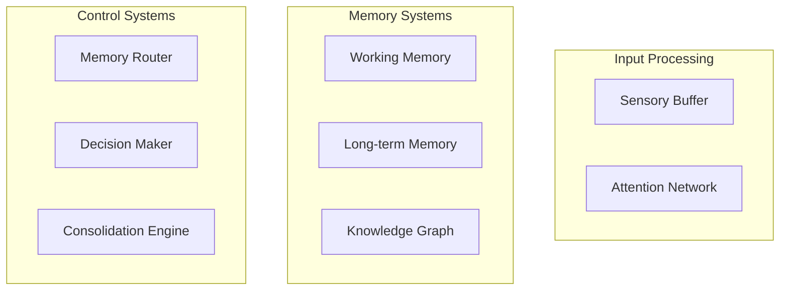

# Neural Memory System Specification
Version: 1.0
Last Updated: 2024-12-17

## 1. System Overview

### 1.1 Purpose
Develop a neuroscience-inspired memory system for LLMs that integrates:
- Multi-modal information processing
- Cognitive architecture principles
- Decision theory frameworks
- Advanced attention mechanisms

### 1.2 Scope
- Memory management and organization
- Cognitive processing operations
- Integration capabilities
- User interaction patterns

## 2. Functional Requirements

### 2.1 Memory Management
#### Core Operations
- Store multi-modal information (text, code, concepts)
- Retrieve based on context and relevance
- Maintain contextual relationships
- Support hierarchical organization

#### Memory Types
1. **Sensory Buffer**
   - Rapid information capture
   - Initial filtering
   - Attention-based processing
   
2. **Working Memory**
   - Active context maintenance
   - Limited capacity management
   - Temporal processing
   
3. **Long-term Memory**
   - Persistent storage
   - Pattern recognition
   - Knowledge consolidation
   
4. **Knowledge Graph**
   - Relationship mapping
   - Semantic connections
   - Causal dependencies

### 2.2 Cognitive Operations

#### Attention System
- Bottom-up salience detection
- Top-down goal alignment
- Resource allocation optimization
- Context switching management

#### Memory Consolidation
- Pattern strengthening
- Information reorganization
- Knowledge integration
- Forgetting mechanisms

#### Decision Making
- Information gain assessment
- Uncertainty reduction tracking
- Resource allocation optimization
- Action selection mechanisms

### 2.3 Integration Capabilities

#### LLM Integration
- Bidirectional communication
- Context sharing
- Memory-augmented processing
- Response generation

#### External Systems
- API connectivity
- Data source integration
- Tool interaction
- Export capabilities

## 3. Non-Functional Requirements

### 3.1 Performance
- Response time: < 2s for common operations
- Throughput: 100+ operations/second
- Capacity: 100K+ memory items
- Latency: < 100ms for critical paths

### 3.2 Scalability
- Horizontal scaling support
- Dynamic resource allocation
- Modular architecture
- Stateless operations

### 3.3 Reliability
- 99.9% uptime
- Data persistence
- Error recovery
- Operation logging

### 3.4 Security
- Memory isolation
- Access control
- Data encryption
- Audit logging

## 4. Technical Architecture

### 4.1 System Components

### 4.2 Technology Stack
- Vector Store: Milvus/Qdrant
- Graph Database: Neo4j
- Message Bus: Kafka
- API Layer: FastAPI
- LLM Integration: LangChain

## 5. Implementation Phases

### Phase 1: Core Memory
- Basic memory operations
- Storage implementation
- Retrieval mechanisms
- Initial testing

### Phase 2: Cognitive Systems
- Attention implementation
- Decision making
- Memory consolidation
- Integration testing

### Phase 3: Advanced Features
- Knowledge graph
- Advanced retrieval
- Performance optimization
- Scale testing

### Phase 4: Production Readiness
- Security implementation
- Monitoring setup
- Documentation
- Deployment preparation

## 6. Testing Strategy

### 6.1 Test Categories
- Unit tests for components
- Integration tests for systems
- Performance testing
- Security testing

### 6.2 Acceptance Criteria
- Functional completeness
- Performance metrics
- Reliability measures
- Security compliance

## 7. Documentation Requirements

### 7.1 System Documentation
- Architecture documentation
- API documentation
- Operation manuals
- Deployment guides

### 7.2 User Documentation
- User guides
- Integration guides
- Troubleshooting guides
- Best practices

## 8. Maintenance and Support

### 8.1 Monitoring
- System health monitoring
- Performance monitoring
- Usage analytics
- Error tracking

### 8.2 Updates
- Regular maintenance
- Feature updates
- Security patches
- Performance optimization

## 9. Success Metrics

### 9.1 Performance Metrics
- Response times
- Throughput rates
- Error rates
- Resource utilization

### 9.2 User Metrics
- User satisfaction
- Task completion rates
- Error recovery rates
- Learning curve measurements

---

## Appendix A: Glossary
- **Attention Network**: System for focusing processing resources
- **Memory Router**: Component for directing information flow
- **Consolidation Engine**: System for strengthening and organizing memories
- **Knowledge Graph**: Network of connected information and relationships

## Appendix B: References
1. Neuroscience-inspired cognitive architectures
2. Decision theory frameworks
3. Memory consolidation research
4. Attention mechanisms in biological systems
