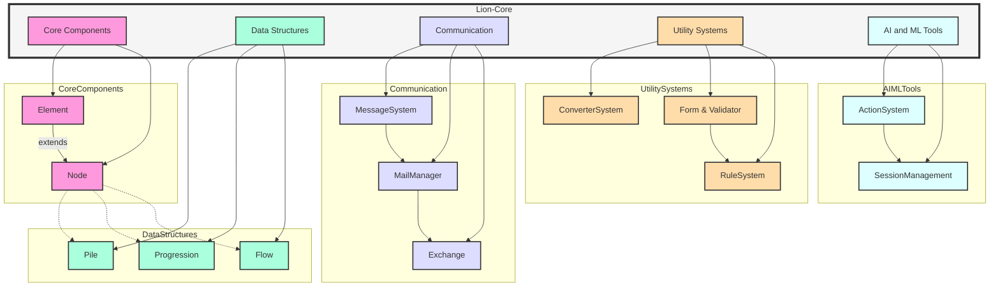

# 🦁 Lion-Core: Unleash the Power of AI Development

[](https://www.python.org/downloads/)

[](LICENSE)


> Lion-Core is a lightweight yet powerful Python library designed to serve as a foundational framework for machine learning, artificial intelligence, workflow automation, scientific computing, and advanced data management.

---

## 🌟 Highlights

| Feature | Description |
|---------|-------------|
| 🧘‍♂️ **Minimal Dependencies** | Built with only `Pydantic`, ensuring a lightweight and maintainable codebase |
| 🧩 **Extensible Architecture** | Modular design adaptable to a wide range of computational needs |
| ⚡ **Performance-Focused** | Optimized data structures and algorithms for efficient large-scale data processing |
| 🛡️ **Type-Safe** | Leveraging Pydantic for robust type checking and data validation |

---

## 🚀 Features

### 📊 Advanced Data Structures
- **Pile**: A flexible container combining the best of lists and dictionaries, offering efficient access and powerful querying capabilities.
- **Progression**: An ordered sequence container designed for high-performance operations on large datasets.
- **Flow**: A versatile structure for managing complex workflows and data pipelines.

### 🧱 Core Components
- **Element**: A foundational class serving as the building block for creating modular and composable components.
- **Node**: An extension of Element, designed for creating interconnected components in a graph-like structure.
- **Exchange**: A system for managing asynchronous communication between components.

### 🛠️ Utility Systems
- **Converter System**: A flexible framework for seamless data conversion between various formats.
- **Form and Validator System**: Dynamic tools for creating and validating complex data structures and workflows.
- **Rule System**: A powerful mechanism for defining and enforcing business logic and data constraints.

### 💬 Communication Framework
- **Message System**: A robust inter-component messaging system, facilitating the development of distributed and microservices-based applications.
- **Mail Manager**: An advanced system for managing asynchronous communication across different components and processes.

### 🧠 AI and Machine Learning Tools
- **Action System**: A framework for defining and executing AI actions and function calls.
- **Session Management**: Tools for managing conversational contexts and multi-turn interactions in AI systems.

---

## 🏗️ Architecture

Lion-Core's architecture is designed to be both powerful and flexible, allowing developers to build complex AI and machine learning applications with ease. The following diagram illustrates the high-level architecture and key components of the library:



Each component can be used independently or in combination with others, enabling modular and scalable application development.

---

## 📦 Installation

To install the latest stable version from PyPI:

```bash
pip install lion-core
```

For the latest development version:

```bash
pip install git+https://github.com/lion-agi/lion-core.git
```

---

## 🛠️ Development Setup

<details>
<summary>Click to expand</summary>

1. Clone the repository:
    ```bash
    git clone https://github.com/lion-agi/lion-core.git
    cd lion-core
    ```

2. Set up a virtual environment:
    ```bash
    python -m venv venv
    source venv/bin/activate  # On Windows use `venv\Scripts\activate`
    ```

3. Install dependencies:
    ```bash
    pip install -e .[dev]
    ```

4. Set up pre-commit hooks:
    ```bash
    pre-commit install
    ```

5. Run tests:
    ```bash
    pytest --asyncio-mode=auto --maxfail=1 --disable-warnings tests/
    ```

6. Check code style:
    ```bash
    black --check .
    isort --check-only .
    ```

7. (Optional) Run pre-commit hooks manually:
    ```bash
    pre-commit run --all-files
    ```

Note: Pre-commit hooks will run automatically on `git commit`. If any checks fail, the commit will be aborted. Fix the issues and try committing again.

</details>

---

## 📚 Documentation

We are continuously improving our documentation to help you get the most out of Lion-Core. Here's what's available:

| Type | Description | Location |
|------|-------------|----------|
| 📘 Reference Docs | API references and core concepts | [API References](https://github.com/lion-agi/lion-core/blob/main/resources/references/ref_component.ipynb) |
| 💻 Inline Docs | Detailed docstrings for all components | Within source code |
| 📓 Examples & Tutorials | (Coming Soon) Jupyter notebooks | `examples/` directory |
| 🌐 Online Docs | (Planned) Comprehensive searchable documentation | TBA |

Our reference documentation includes:
- Comprehensive API documentation for all modules
- In-depth explanations of key concepts and data structures
- Usage guidelines and best practices

Stay tuned for updates as we continue to expand our documentation!

---

## 🛣️ Roadmap

As we work towards stable releases, our focus includes:

- Enhancing core abstractions and data structures
- Expanding the converter system for broader compatibility
- Refining workflow automation processes
- Developing additional scientific computing utilities
- Improving documentation and adding comprehensive examples

We're committed to evolving Lion-Core to meet the needs of our community. Your feedback and contributions are crucial in shaping the future of this library.

---

## 🤝 Contributing

We welcome contributions from the community! Whether it's bug fixes, feature additions, or documentation improvements, your input is valuable. Please check our [CONTRIBUTING.md](CONTRIBUTING.md) for guidelines on how to contribute.

If you're planning to work on a significant change, please open an issue first to discuss your ideas. This helps ensure your time is well spent and that the changes align with the project's direction.

---

## 📄 License

Lion-Core is released under the Apache License 2.0. See the [LICENSE](LICENSE) file for details.

---

## 📬 Contact & Community

- 🐛 **Issues & Feature Requests**: [GitHub Issues](https://github.com/lion-agi/lion-core/issues)
- 💬 **Discussions & Support**: Join our [Discord Server](https://discord.gg/JDj9ENhUE8)

We're building a community of developers, researchers, and AI enthusiasts. Join us in shaping the future of AI development!

---

> **Note**: Lion-Core is an extraction and refinement of core components from the larger lionagi project. After reaching version 0.1.0, development will continue on Lion-Core while also informing a rewrite of the lionagi library.

Thank you for your interest in Lion-Core. Together, let's unleash the power of AI development! 🦁✨
