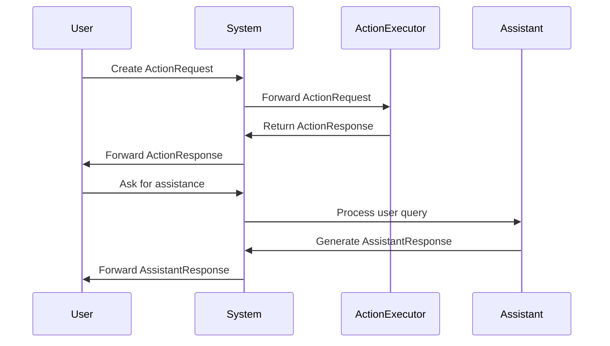

# ActionExecutor API Documentation



The `ActionProcessor` class handles the execution of actions in the Lion framework. It manages concurrency, throttling, and provides retry and error handling capabilities.

## Class: ActionProcessor

### Attributes

- `capacity: int` - Maximum number of actions processed concurrently.
- `queue: asyncio.Queue` - Queue holding actions to be processed.
- `_stop_event: asyncio.Event` - Event to signal stopping the processing.
- `available_capacity: int` - The remaining processing capacity.
- `execution_mode: bool` - Flag indicating if processor is executing.
- `refresh_time: float` - Time interval between processing cycles.

### Properties

- `stopped: bool` - Indicates whether the processor has been stopped.

### Methods

#### `__init__(capacity: int, refresh_time: float)`

Initializes an ActionProcessor instance.

- **Parameters:**
  - `capacity: int` - Max number of actions processed concurrently.
  - `refresh_time: float` - Time interval between processing cycles.
- **Raises:**
  - `ValueError` - If capacity < 0 or refresh_time is negative.

#### `async enqueue(action: ObservableAction) -> None`

Enqueues an action to the processor queue.

- **Parameters:**
  - `action: ObservableAction` - The action to be added to the queue.

#### `async dequeue() -> ObservableAction`

Dequeues an action from the processor queue.

- **Returns:**
  - `ObservableAction` - The next action in the queue.

#### `async join() -> None`

Blocks until all items in the queue have been processed.

#### `async stop() -> None`

Signals the processor to stop processing actions.

#### `async start() -> None`

Allows the processor to start or continue processing.

#### `async process() -> None`

Processes the work items in the queue.

#### `async execute()`

Executes the processor, continuously processing actions until stopped.

#### `@classmethod async create(**kwargs: Any) -> ActionProcessor`

Class method to create an instance of ActionProcessor.

- **Parameters:**
  - `**kwargs: Any` - Arguments passed to the ActionProcessor constructor.
- **Returns:**
  - `ActionProcessor` - A new instance of ActionProcessor.

#### `async request_permission(**kwargs: Any) -> bool`

Placeholder method to request permission before processing an action.

- **Parameters:**
  - `**kwargs: Any` - Arbitrary keyword arguments for requesting permission.
- **Returns:**
  - `bool` - Always returns True, indicating permission is granted.

#### `async get_processing_status() -> dict`

Retrieves the current processing status.

- **Returns:**
  - `dict` - A dictionary containing the following keys:
    - `queued: int` - Number of actions in the queue.
    - `active: int` - Number of actions currently being processed.
    - `completed: int` - Number of actions that have been processed.

#### `set_error_handler(handler: Callable[[Exception, ObservableAction], None]) -> None`

Sets a custom error handler for action processing errors.

- **Parameters:**
  - `handler: Callable[[Exception, ObservableAction], None]` - A function to handle errors during action processing.

## Usage Example

```python
async def main():
    processor = await ActionProcessor.create(capacity=10, refresh_time=5)

    def error_handler(error: Exception, action: ObservableAction):
        print(f"Error processing action {action.ln_id}: {error}")

    processor.set_error_handler(error_handler)

    await processor.start()

    action = ObservableAction(...)
    await processor.enqueue(action)
    await processor.process()

    status = await processor.get_processing_status()
    print(f"Current status: {status}")

    await processor.stop()

asyncio.run(main())
```

This example shows how to create an ActionProcessor, enqueue actions, process them, and handle potential errors.
The `ActionExecutor` class manages and coordinates the processing of actions in the Lion framework. It works in conjunction with an `ActionProcessor` to efficiently handle multiple actions asynchronously.

## Class: ActionExecutor

### Attributes

- `processor_config: dict` - Configuration for initializing the processor.
- `processor_class: Type[ActionProcessor]` - Class used to process actions (default: `ActionProcessor`).
- `pile: Pile[ObservableAction]` - A collection of actions managed by the executor.
- `pending: Progression` - A progression tracking the pending actions.
- `processor: ActionProcessor` - The action processor instance.

### Properties

- `pending_actions: Pile` - Retrieves a pile of all pending actions.
- `completed_actions: Pile` - Retrieves a pile of all completed actions.

### Methods

#### `__init__(**kwargs: Any) -> None`

Initializes the ActionExecutor with the provided configuration.

- **Parameters:**
  - `**kwargs: Any` - Configuration parameters for initializing the processor.

#### `async append(action: ObservableAction) -> None`

Appends a new action to the executor.

- **Parameters:**
  - `action: ObservableAction` - The action to be added to the pile.

#### `async create_processor() -> None`

Creates the processor for handling actions.

#### `async start() -> None`

Starts the action processor.

#### `async stop() -> None`

Stops the action processor.

#### `async forward() -> None`

Forwards pending actions to the processor for processing.

#### `async get_status() -> dict`

Retrieves the current status of action processing.

- **Returns:**
  - `dict` - A dictionary containing counts of pending, active, and completed actions.

#### `set_error_handler(handler: Callable[[Exception, ObservableAction], None]) -> None`

Sets a custom error handler for action processing errors.

- **Parameters:**
  - `handler: Callable[[Exception, ObservableAction], None]` - A function to handle errors during action processing.

#### `__contains__(action: ObservableAction | str) -> bool`

Checks if an action is present in the pile.

- **Parameters:**
  - `action: ObservableAction | str` - The action to check.
- **Returns:**
  - `bool` - True if the action is in the pile, False otherwise.

#### `__iter__() -> Iterator[ObservableAction]`

Returns an iterator over the actions in the pile.

- **Returns:**
  - `Iterator[ObservableAction]` - An iterator over the actions in the pile.

## Usage Example

```python
async def main():
    executor = await create_action_system(capacity=10, refresh_time=5)

    def error_handler(error: Exception, action: ObservableAction):
        print(f"Error processing action {action.ln_id}: {error}")

    executor.set_error_handler(error_handler)

    action = ObservableAction(...)
    await executor.append(action)
    await executor.forward()

    status = await executor.get_status()
    print(f"Current status: {status}")

    await executor.stop()

asyncio.run(main())
```

This example demonstrates how to create an ActionExecutor, add actions to it, process them, and handle potential errors.

## Helper Functions

### `async create_action_system(capacity: int = 10, refresh_time: float = 5.0) -> ActionExecutor`

A factory function that creates and initializes an ActionExecutor with sensible defaults.

- **Parameters:**
  - `capacity: int` - The maximum number of concurrent actions (default: 10).
  - `refresh_time: float` - The time interval between processing cycles (default: 5.0).
- **Returns:**
  - `ActionExecutor` - An initialized ActionExecutor instance.

```python
executor = await create_action_system()
```

This function simplifies the setup process for users who don't need fine-grained control over the configuration.
