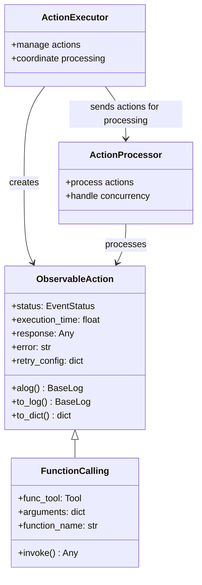

# ActionProcessor API Documentation

The `ActionProcessor` class handles the execution of actions in the Lion framework. It manages concurrency, throttling, and provides retry and error handling capabilities.





## Class: ActionProcessor

### Attributes

- `capacity: int` - Maximum number of actions processed concurrently.
- `queue: asyncio.Queue` - Queue holding actions to be processed.
- `_stop_event: asyncio.Event` - Event to signal stopping the processing.
- `available_capacity: int` - The remaining processing capacity.
- `execution_mode: bool` - Flag indicating if processor is executing.
- `refresh_time: float` - Time interval between processing cycles.

### Properties

- `stopped: bool` - Indicates whether the processor has been stopped.

### Methods

#### `__init__(capacity: int, refresh_time: float)`

Initializes an ActionProcessor instance.

- **Parameters:**
  - `capacity: int` - Max number of actions processed concurrently.
  - `refresh_time: float` - Time interval between processing cycles.
- **Raises:**
  - `ValueError` - If capacity < 0 or refresh_time is negative.

#### `async enqueue(action: ObservableAction) -> None`

Enqueues an action to the processor queue.

- **Parameters:**
  - `action: ObservableAction` - The action to be added to the queue.

#### `async dequeue() -> ObservableAction`

Dequeues an action from the processor queue.

- **Returns:**
  - `ObservableAction` - The next action in the queue.

#### `async join() -> None`

Blocks until all items in the queue have been processed.

#### `async stop() -> None`

Signals the processor to stop processing actions.

#### `async start() -> None`

Allows the processor to start or continue processing.

#### `async process() -> None`

Processes the work items in the queue.

#### `async execute()`

Executes the processor, continuously processing actions until stopped.

#### `@classmethod async create(**kwargs: Any) -> ActionProcessor`

Class method to create an instance of ActionProcessor.

- **Parameters:**
  - `**kwargs: Any` - Arguments passed to the ActionProcessor constructor.
- **Returns:**
  - `ActionProcessor` - A new instance of ActionProcessor.

#### `async request_permission(**kwargs: Any) -> bool`

Placeholder method to request permission before processing an action.

- **Parameters:**
  - `**kwargs: Any` - Arbitrary keyword arguments for requesting permission.
- **Returns:**
  - `bool` - Always returns True, indicating permission is granted.

#### `async get_processing_status() -> dict`

Retrieves the current processing status.

- **Returns:**
  - `dict` - A dictionary containing the following keys:
    - `queued: int` - Number of actions in the queue.
    - `active: int` - Number of actions currently being processed.
    - `completed: int` - Number of actions that have been processed.

#### `set_error_handler(handler: Callable[[Exception, ObservableAction], None]) -> None`

Sets a custom error handler for action processing errors.

- **Parameters:**
  - `handler: Callable[[Exception, ObservableAction], None]` - A function to handle errors during action processing.

## Usage Example

```python
async def main():
    processor = await ActionProcessor.create(capacity=10, refresh_time=5)

    def error_handler(error: Exception, action: ObservableAction):
        print(f"Error processing action {action.ln_id}: {error}")

    processor.set_error_handler(error_handler)

    await processor.start()

    action = ObservableAction(...)
    await processor.enqueue(action)
    await processor.process()

    status = await processor.get_processing_status()
    print(f"Current status: {status}")

    await processor.stop()

asyncio.run(main())
```

This example shows how to create an ActionProcessor, enqueue actions, process them, and handle potential errors.
